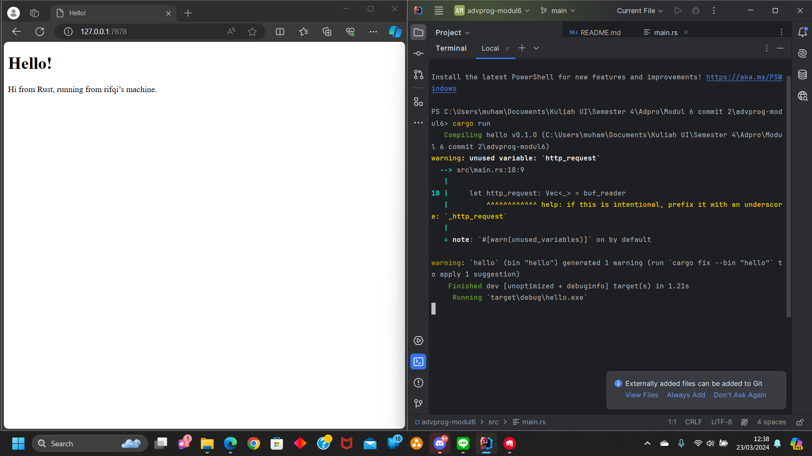
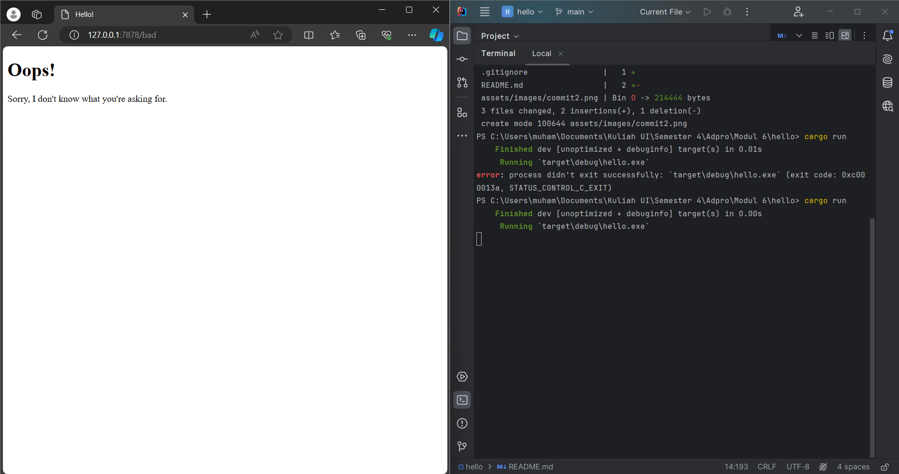

# Module 6
## Commit 1 notes
**What is inside the handle_connection method?**

It takes ownership of a TcpStream, stream, representing a connection to a client. It creates a BufReader wrapping the TcpStream. This buffered reader allows reading lines from the stream efficiently. It reads lines from the buffered reader (buf_reader.lines()). Each line corresponds to a part of the HTTP request until empty line. It collects the lines into a Vec<String> called http_request. Finally, it prints out the collected HTTP request for debugging purposes.

## Commit 2 notes
**What is inside the handle_connection method?**

There are some addtional line in the new handle_connection method. Defines the status line of the HTTP response indicating success. Then gets the length of the contents read from the file. Formats the HTTP response string using the status line, content length, and the contents read from the file. Then send the HTTP response back to the client.

## Commit 3 notes

Now my updated handle_connection, can give the different repsonse for different path. Also i do some refactoring. Use an if-else statement to give an appropriate html and status code response.

## Commit 4 notes
On my updated code, right now when i access "/sleep", there will be several time to wait to get the response. Also, when i access "/sleep" and open on another window with path "/", it also take several time. The path "/" will wait the first access "/sleep" to be completed, then the "/" will get the response.

## Commit 5 notes
Threadpool is a collection of a threads are created and managed together to excuting task concurently. When a task needs to be executed, it's assigned to one of the threads in the pool, which then processes it. Thread pools are commonly used in multi-threaded programming to improve performance and resource management. With limiting the number of threads in threadpool, we can reduce the impact of a DoS attack.  